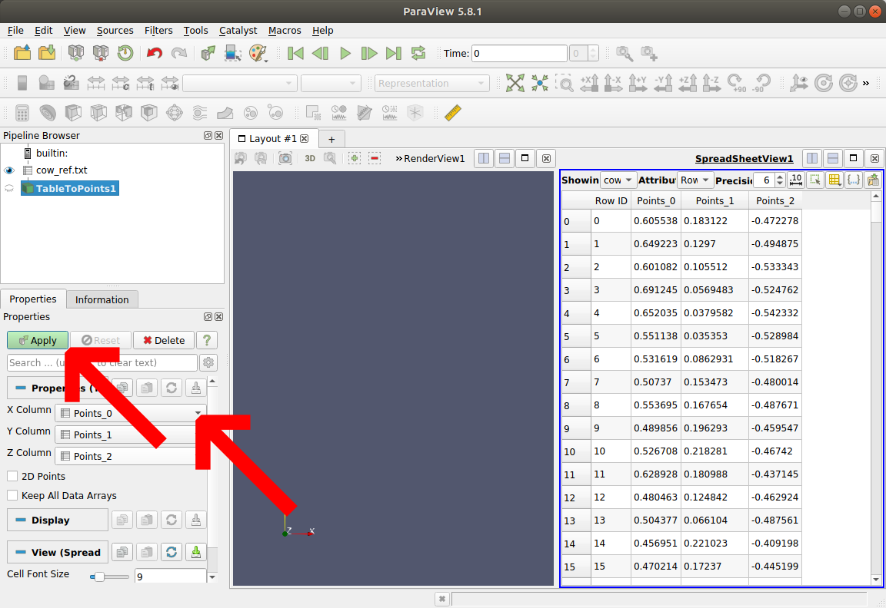
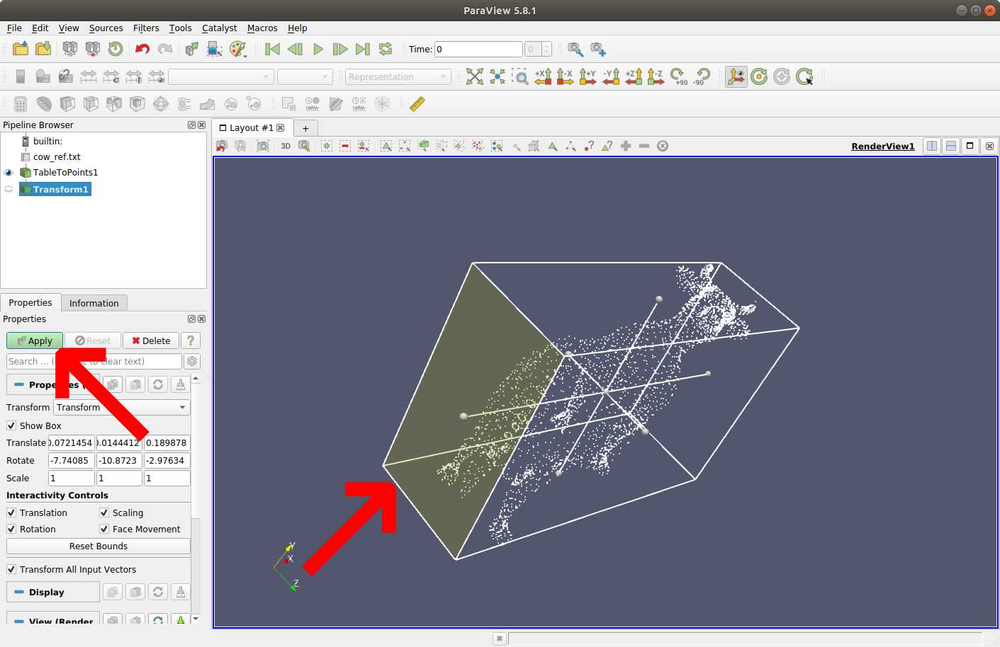
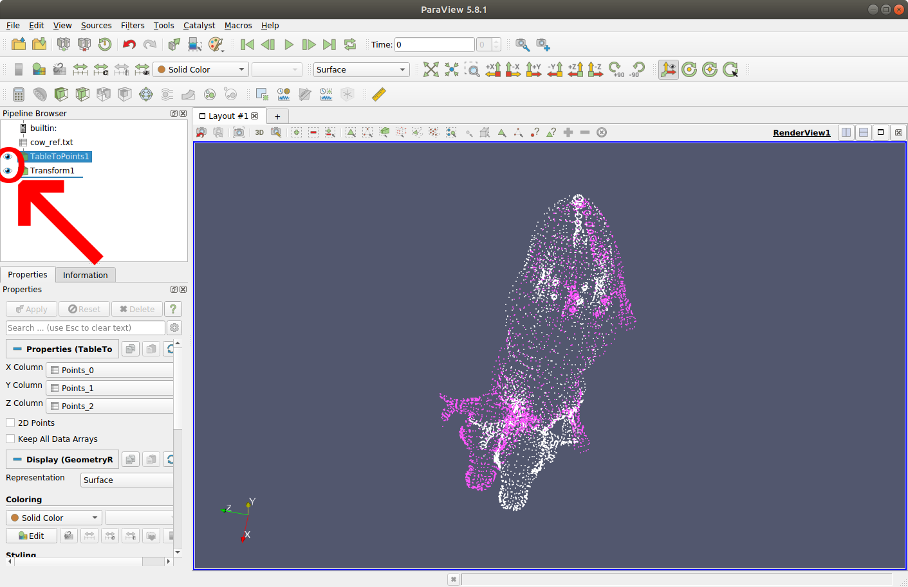
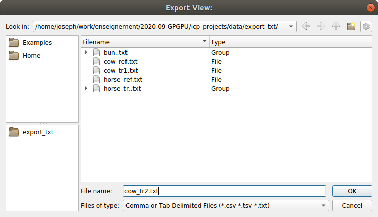
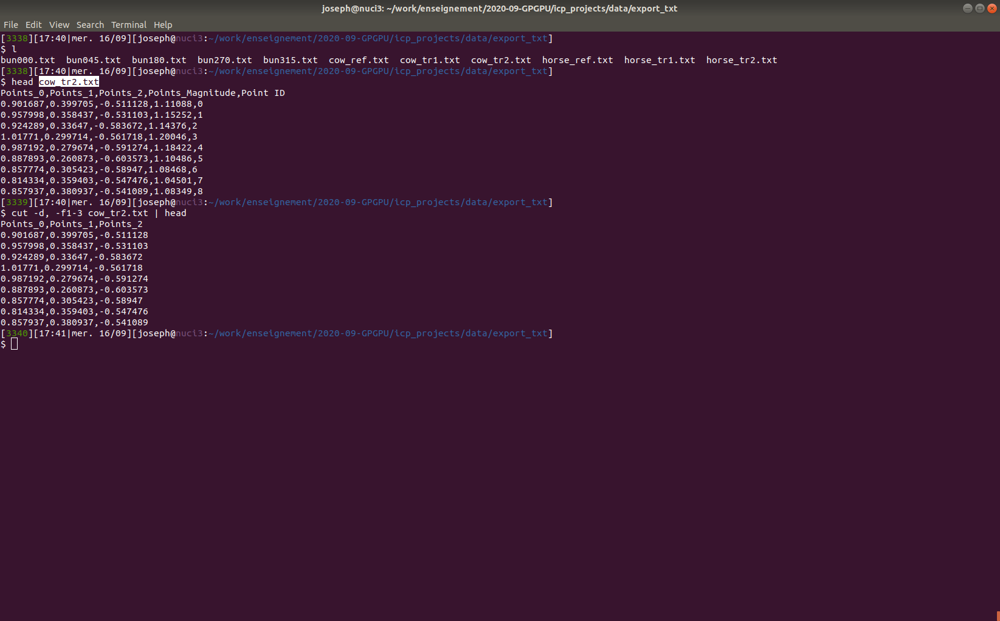

# Using Paraview to display and transform simple point clouds
**J. Chazalon — 2020-09-17**

This short tutorial contains two sections:

1. How to display simple point clouds?
2. How to apply a transformation to a point cloud and generate a new text file?

## How to display simple point clouds?
This section will teach you how to visualize in 3D the content of a simple line of point coordinates.

### Input file
Here, we are talking about CSV files which look like this:
```
$ head bun000.txt
Points_0,Points_1,Points_2
-0.06325,0.0359793,0.0420873
-0.06275,0.0360343,0.0425949
-0.0645,0.0365101,0.0404362
-0.064,0.0366195,0.0414512
-0.0635,0.0367289,0.0424662
-0.063,0.0367836,0.0429737
-0.0625,0.0368247,0.0433543
-0.062,0.0368657,0.0437349
-0.0615,0.0369067,0.0441155
```

- Files contain a variable number of lines.
- The first line is a header, and other lines are point coordinates.
- Point coordinates are separated by commas (`,`) and are written in dot-separated float format.
- The range of possible values for the coordinates is unconstrained here.

### Open Paraview
You can download this great software from the [official page](https://www.paraview.org/download/),
then just extract the archive and launch the binary `bin/paraview`.
This should give you this window.

{width=1024px}

### Open a CSV file containing coordinates
Press <kbd>Ctrl</kbd>+<kbd>O</kbd> (Linux) to open a CSV file containing coordinates.
You get the following window.


### Select and apply the CSV parsing options
In order to interpret the CSV content properly, you need to tell Paraview what is the field delimiter (`,` here) and whether the first line is a header (yes).
The default parameters should be correct in our case.

Then, you can press the "Apply" button to validate the import, as illustrated below.

{width=1024px}

### The spreadsheet view opens
You should now have a new spreadsheet view active, as illustrated below.
This is because Paraview doesn't know yet how to render the content of this file.
You can either keep the spreadsheet view or close it.
It is easy to create new views on demand.

{width=1024px}

### Add a Tabular to Points filter
In order to create an internal point representation that can be displayed, we need to add a "Tabular to Points" filter.
To add a filter, press <kbd>Ctrl</kbd>+<kbd>Space</kbd> (Linux) or use the "Filters">"Search..." menu entry.
In the search window, start typing "Tab to p…" to restrict the list of filters, then select the appropriate one, as illustrated below.


### Configure the filter
We need to specify which columns of the tabular data will be mapped to X, Y and Z coordinates.
Then, we need to click the "Apply" button to activate the new data filter in our pipeline, as illustrated below.

{width=1024px}

### Display the point cloud
We are now ready to display the point cloud.
First, make sure you select the render view (click on it), as illustrated below.

{width=1024px}

Then, you need to click on the small eye icon on the left side of the last filter we created in our pipeline to display our point cloud, as illustrated below.

{width=1024px}


## How to apply a transformation to a point cloud and generate a new text file?
This section will teach you how to apply a simple rigid transformation to your point cloud and save it in the same format as the files we provide.
This is useful if you want to create more variants of the 3D models we provide, or simply to quickly apply a small transformation on a vary simple point cloud you created by hand.
**Indeed, we encourage you to generate very simple point clouds (less than 10 points) to test your algorithms when you implement them.**

### Add a filter transform
We reuse the pipeline from section 1 here: we need a set of points to process.
Then, we add a "Transform" filter.
To add such filter, press <kbd>Ctrl</kbd>+<kbd>Space</kbd> (Linux) or use the "Filters">"Search..." menu entry, then start typing the name of the "transform" filter, as illustrated below.


### Define a transformation
In order to define the parameters of your transformation, you can either select their values directly (translation in X, Y and Z directions, rotations around X, Y and Z axis) or manipulate the transform box in the render view, as illustrated below.
**Avoid creating transforms with scaling different from 1 in any axis: the Iterative Closest Point algorithm does not handle scaling.**
After selecting the transform parameters, you need to click the "Apply" button to activate this new filter in our data processing pipeline.

{width=1024px}

### Display both original and transformed point clouds
You can display both original and transformed point clouds to check your parameters.
To do so, select the render view and click on the eye icon on the left of each of the filters for which you want to display the outputs, as illustrated below.

{width=1024px}

### Export the new point cloud
To export your new point cloud data, you need to select the spreadsheet view.
You can easily create a new spreadsheet view by closing the current view, or by adding a new one: a menu will ask for the kind of view to create.
To start the export, you need to click on the export button of the spreadsheet view, as illustrated below.

{width=1024px}

Then, save the file as either ".txt" or ".csv" file.



### Finally, fix the content of the file
By default, Paraview will add extra columns to our file.
You can remove those unnecessary columns with a simple `cut` command, as illustrated below.

{width=1024px}


*You reached the end of this tutorial, we hope it was helpful.*